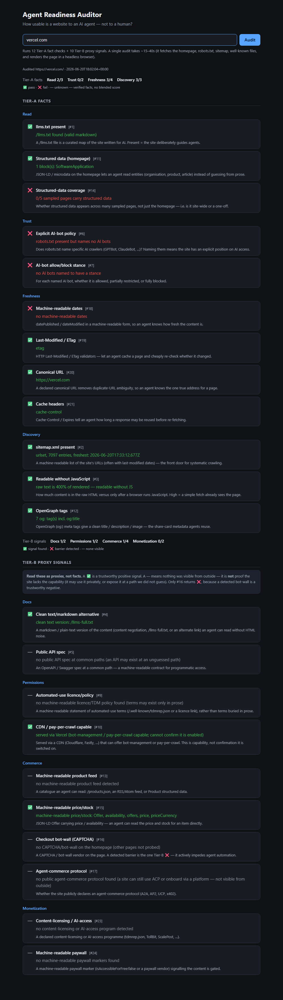

# Agent Readiness Auditor

A command-line tool that audits one website for how usable it is to **AI agents** rather than to humans. It runs 22 checks and prints a pass / fail / unknown checklist — no blended score, no guessing.

The premise comes from a simple shift: people increasingly reach the web *through* an AI (ChatGPT, Claude, Perplexity), so the AI is the one actually reading sites. This tool measures how legible a site is to that machine reader — can an agent **read** the content, **trust** it, and **transact** with it?

```bash
python agent_audit.py https://example.com
```

```text
Agent Readiness — https://example.com/
============================================================

Read
  ❌ [ 1] llms.txt present — no /llms.txt
  ✅ [ 3] Readable without JavaScript — raw text is 110% of rendered — readable without JS
  ...

Tier-B proxy signals  (✅ positive · ❌ barrier detected · — none visible — NOT proof of absence)
  Permissions
    ✅ [10] CDN / pay-per-crawl capable — served via Cloudflare (...)
  ...
------------------------------------------------------------
Tier-A facts   — Read 0/3 · Trust 0/2 · Freshness 1/4 · Discovery 1/3   (✅ pass · ❌ fail · — unknown; no blended score)
Tier-B signals — Docs 0/2 · Permissions 1/2 · Commerce 0/4 · Monetization 0/2   (✅ found · ❌ barrier · — none visible; signals, not proof)
```

## Web UI

Prefer a browser to a terminal? A single-file web app wraps the same auditor — type a URL, get the Tier-A facts and Tier-B signals laid out and explained, each check with its live finding **and** a plain-English note on what it looks for.

**▶ Live page: <https://az9713.github.io/agent-readiness-auditor/>** — the project's home on GitHub Pages: see what a report looks like, request an audit (it opens a GitHub issue), and get the one-command local setup.



> The Pages site is **static**, so it can't run an audit in the browser (no server, no headless Chromium, and CORS blocks cross-origin fetches). For instant, fully-interactive audits, run the web UI locally — stdlib-only, no Flask, no extra dependency:

```bash
python webapp.py            # then open http://127.0.0.1:8000
```

It reuses `agent_audit.py` unchanged, so the page and the CLI can never disagree about a result. See [docs/getting-started/web-ui.md](docs/getting-started/web-ui.md). To host a backend that audits in-browser, see [DEPLOY.md](DEPLOY.md).

## The development journey

This project was built incrementally, and each design fork is documented in full:

- **[development-journey.md](development-journey.md)** — how the tool came to exist (it started with a podcast on bots overtaking web traffic), every design decision, the agent-commerce protocols, and a transparency statement of what the app does and does not do.
- **[agent-readiness-auditor.md](agent-readiness-auditor.md)** — the design reference: the full 25-check catalog, the Tier A/B/C feasibility analysis, and the no-score decision.
- **[docs/](docs/)** — production documentation (installation, quickstart, checks reference, CLI reference, architecture, troubleshooting). Start at [docs/index.md](docs/index.md).

## What it checks

The 22 checks split into two tiers by how reliably an outside tool can measure them.

**Tier A — facts (12 checks).** Deterministic: one fetch or one parse gives a clear `pass` / `fail` / `unknown`.

| Group | Checks |
|-------|--------|
| Read | `llms.txt`, structured data, coverage |
| Trust | AI-bot policy, allow/block stance |
| Freshness | machine-readable dates, `Last-Modified`/`ETag`, canonical URL, cache headers |
| Discovery | `sitemap.xml`, readable-without-JavaScript, OpenGraph |

**Tier B — proxies (10 checks).** Indirect signals. A ✅ is a trustworthy positive; a `—` means no signal was visible, which is **not** proof of absence. Only the CAPTCHA check returns `❌` (a detected bot-wall is a trustworthy negative).

| Group | Checks |
|-------|--------|
| Docs | clean text/markdown alternative, public API spec |
| Permissions | automated-use licence/TDM policy, CDN / pay-per-crawl capable |
| Commerce | product feed, price/stock, checkout bot-wall (CAPTCHA), agent-commerce protocol (A2A / AP2 / UCP / x402) |
| Monetization | content-licensing / AI-access program, machine-readable paywall |

The 3 Tier-C checks from the design catalog are not implemented — they require an actual transaction and cannot be measured from the outside.

## Install

```bash
pip install -r requirements.txt
python -m playwright install chromium
```

Requires Python 3.11+. See [docs/getting-started/installation.md](docs/getting-started/installation.md) for details.

## Usage

```bash
python agent_audit.py <url> [--json] [--sample N]
```

| Option | Default | Effect |
|--------|---------|--------|
| `url` | — | Site to audit; scheme optional (`https://` added if missing). |
| `--json` | off | Emit JSON instead of the text checklist. |
| `--sample N` | 10 | Pages to sample from the sitemap for the structured-data coverage check. |

Exit code is `0` when the audit runs (regardless of individual results) and `2` when the homepage is unreachable. Full reference: [docs/reference/cli.md](docs/reference/cli.md).

## Test coverage

The test suite is in **[test_auditor.py](test_auditor.py)** — **34 offline tests**, no network and no browser required. Run it with either:

```bash
python test_auditor.py      # plain-assert runner, exit code = pass/fail
pytest test_auditor.py      # also pytest-discoverable
```

Expected: `All 34 offline checks passed.`

What the tests cover:

| Layer | Coverage |
|-------|----------|
| **Parsing helpers** | robots parse + allow/block stance, structured-data / OpenGraph / date / canonical extraction, sitemap parse, agent-commerce protocol detection, CAPTCHA / paywall / CDN / offer / licence detection, `llms.txt` sanity, script-stripping. |
| **All 22 check functions** | each driven by hand-built `Context` objects to exercise its `pass` / `fail` / `unknown` branches, including boundary cases (the JS-readability 60% threshold, case-insensitive header matching, sitemap transport-failure → unknown, homepage-only coverage fallback). |
| **Tier-B proxy semantics** | positive-only reporting, the CAPTCHA barrier-as-`fail` exception (#16), and a `test_tier_b_silence_is_never_a_fact` test proving silence is reported as `unknown`, never fabricated as a failure. |
| **Tier separation** | a test that Tier-A facts and Tier-B signals are summarized separately and never blended into one number. |
| **Integration** | a fully-populated fixture run end-to-end through `run_checks` / `summarize` / `render_text_report`. |
| **Fault isolation** | a check that raises is downgraded to `unknown` — one broken check never sinks the run. |
| **Security** | a billion-laughs XML-bomb test confirming sitemaps are parsed safely with `defusedxml`. |

The checks are pure functions over a fetched-once `Context`, which is what makes the entire suite runnable offline without HTTP mocking.

## Project layout

| Path | Purpose |
|------|---------|
| `agent_audit.py` | The tool: fetch context once, run 22 checks, print text or JSON. |
| `webapp.py` | Local web UI over the same auditor (stdlib `http.server`, no new dependency). |
| `test_auditor.py` | 34 offline tests. |
| `requirements.txt` | `requests`, `beautifulsoup4`, `lxml`, `playwright`, `defusedxml`. |
| `docs/` | Production documentation. |
| `development-journey.md`, `agent-readiness-auditor.md` | The story and the design reference. |
